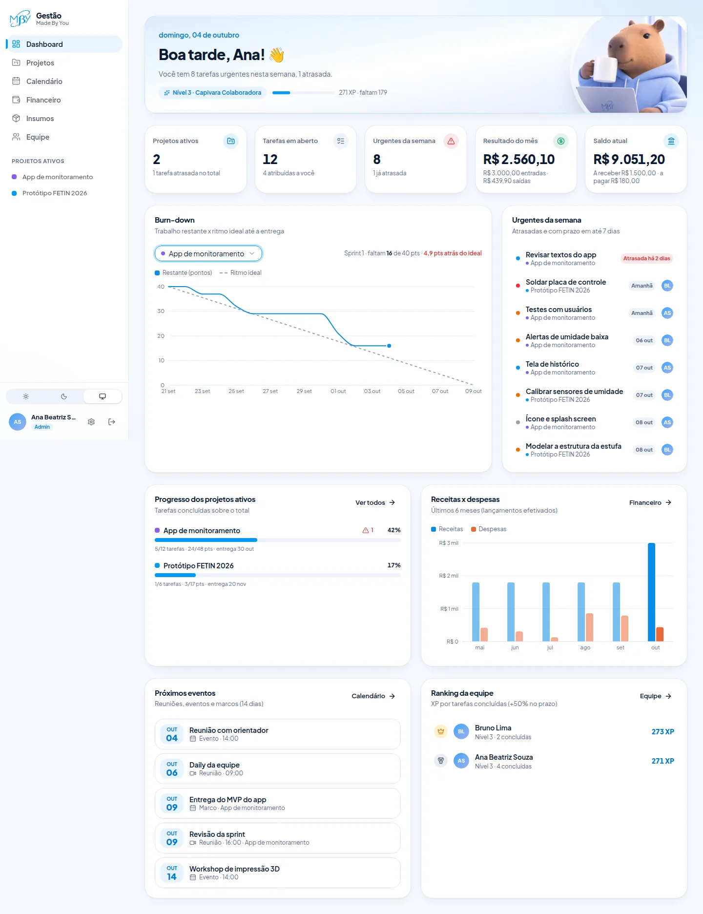
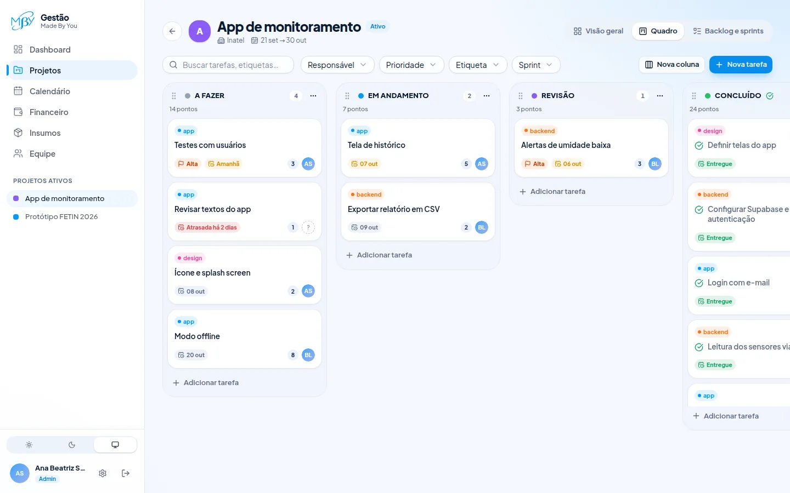
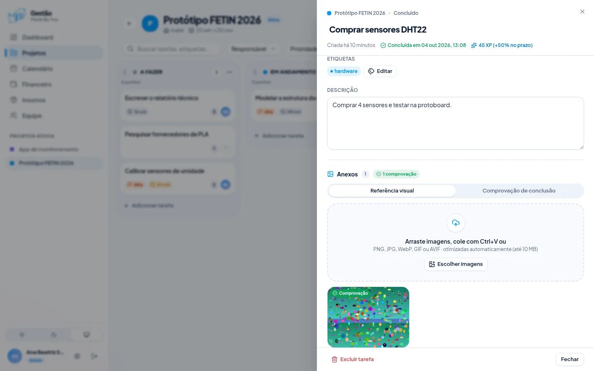
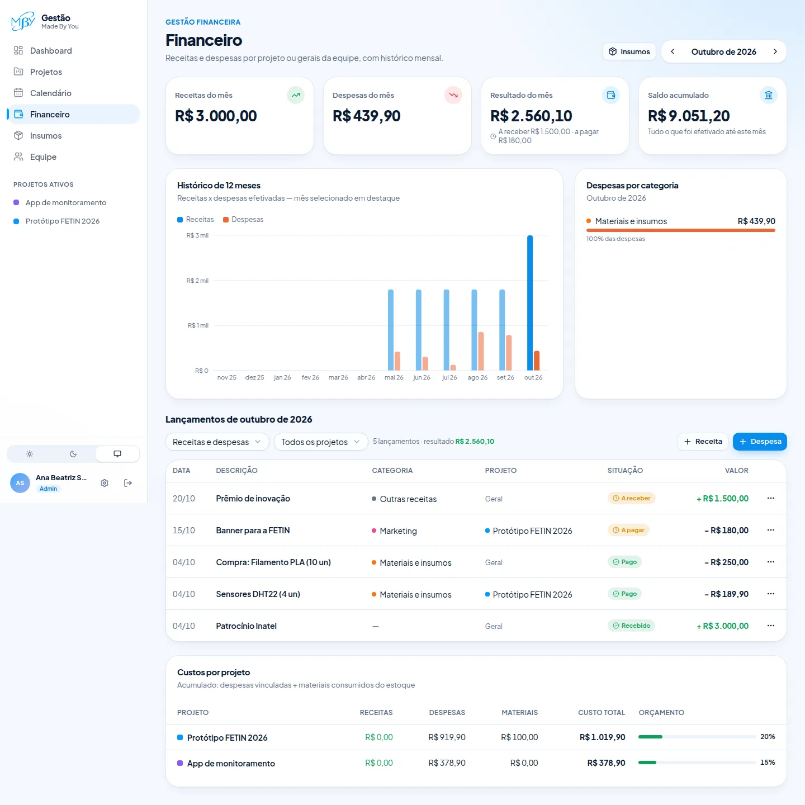
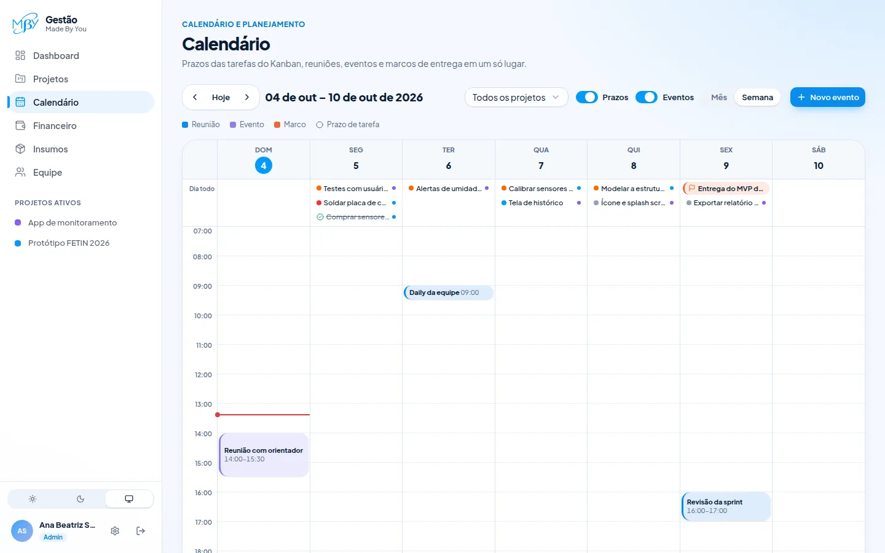
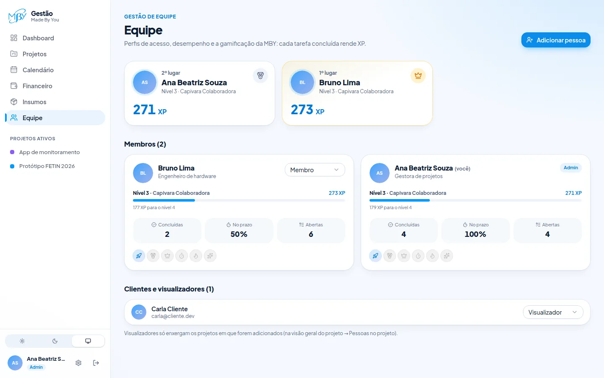
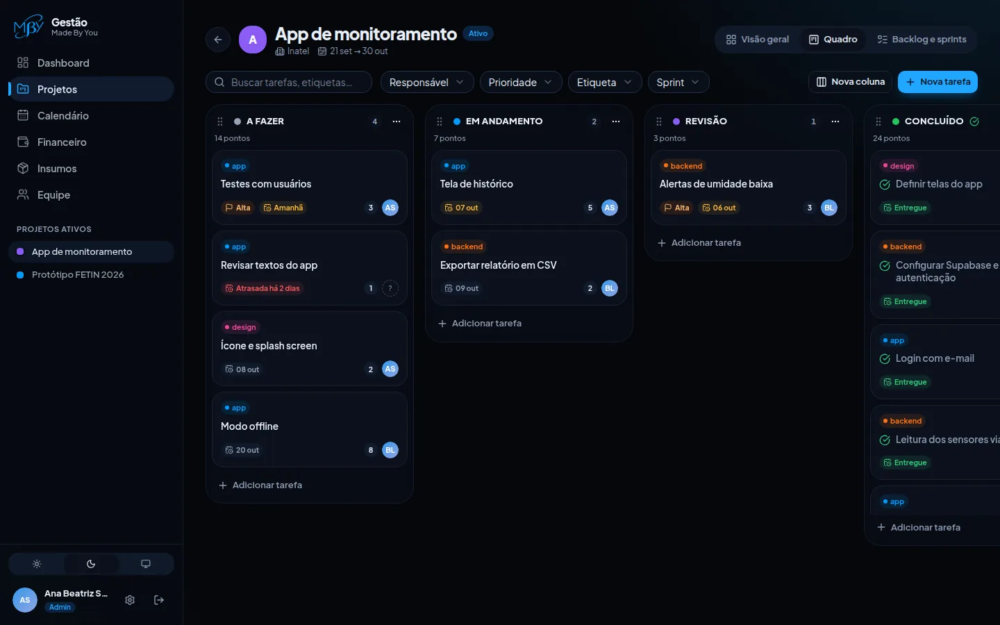

# MBY Gestão

Aplicativo web de **gestão de projetos, finanças e equipe** da MBY — *Made By You*.
Feito com Next.js 16, React 19, TypeScript, Tailwind CSS, componentes no padrão
shadcn/ui e Supabase (Postgres, Auth, Storage e Realtime).

> Arquitetura, modelo de dados, segurança e o funcionamento do Kanban e do upload
> de imagens: **[docs/ARQUITETURA.md](docs/ARQUITETURA.md)**.

## Funcionalidades

**Projetos e tarefas**
- Quadro **Kanban** com colunas personalizáveis (*A Fazer, Em Andamento, Revisão,
  Concluído* por padrão): arrastar e soltar com mouse, toque ou teclado, cores,
  limite WIP e coluna de conclusão.
- **Backlog** e **sprints**: planeje tarefas fora do quadro e, ao iniciar a sprint,
  elas entram no quadro.
- Cards com título, descrição, responsável, etiquetas, prazo, estimativa (pontos)
  e **anexos de imagem** — referência visual ou comprovação de conclusão —
  com compressão automática, barra de progresso, colar com Ctrl+V e câmera no celular.

**Financeiro**
- Receitas e despesas **por projeto ou gerais da equipe**, com categorias e
  status (efetivado/pendente).
- Visão mensal, histórico de 12 meses e custos por projeto versus orçamento.
- **Insumos**: estoque de materiais com custo médio ponderado, entradas
  (opcionalmente lançadas como despesa) e saídas consumidas por projeto.

**Equipe e permissões**
- Perfis **Admin**, **Membro** e **Visualizador/Cliente** (o cliente só enxerga os
  projetos em que foi incluído e não vê o financeiro).
- Métricas individuais e **gamificação**: XP por tarefa concluída (+50% no prazo),
  níveis “Capivara”, conquistas e ranking.

**Calendário** — visões mensal e semanal com os prazos do Kanban, reuniões,
eventos e marcos de entrega. Cada evento tem uma **ata** (o que foi discutido,
decisões, aprendizados e próximos passos), e a página **Atas** reúne todas com busca.

**Dashboard** — burn-down dos projetos ativos, tarefas urgentes da semana, saldo
atual, resultado do mês e receitas × despesas dos últimos meses.

Tudo em português, com tema claro/escuro, layout responsivo e horários no fuso de
Brasília.

**App instalável (PWA)** — no celular, use “Adicionar à tela inicial” (Android/Chrome
ou Safari no iPhone) para abrir o Gestão como um app, em tela cheia e com ícone próprio.

## Telas

<sub>Capturas com dados de demonstração.</sub>

| Dashboard | Quadro Kanban |
| --- | --- |
|  |  |
| **Tarefa com comprovação de conclusão** | **Financeiro** |
|  |  |
| **Calendário semanal** | **Equipe e gamificação** |
|  |  |
| **Tema escuro** | **Celular** |
|  |  |

## Como rodar localmente

Pré-requisitos: **Node.js 20.9+** e npm.

```bash
npm install
cp .env.example .env.local   # já aponta para o projeto Supabase "MBY-Gestao"
npm run dev
```

Abra <http://localhost:3000> e crie sua conta. **A primeira conta cadastrada vira
Admin**; as seguintes entram como Visualizador até um admin promovê-las na
página **Equipe**.

### Variáveis de ambiente

| Variável | Obrigatória | Descrição |
| --- | --- | --- |
| `NEXT_PUBLIC_SUPABASE_URL` | sim | URL do projeto Supabase |
| `NEXT_PUBLIC_SUPABASE_PUBLISHABLE_KEY` | sim | Chave publicável (pode ir ao navegador; os dados são protegidos pela RLS). `NEXT_PUBLIC_SUPABASE_ANON_KEY` também é aceita |
| `NEXT_PUBLIC_SITE_URL` | não | Reserva para a URL pública. Os links de e-mail usam o endereço de onde a pessoa acessou |
| `SUPABASE_SERVICE_ROLE_KEY` | não | Só no servidor. Habilita “convidar por e-mail” na página Equipe. **Nunca faça commit dela** |

### Scripts

| Comando | O que faz |
| --- | --- |
| `npm run dev` | Servidor de desenvolvimento |
| `npm run build` / `npm start` | Build e servidor de produção |
| `npm run lint` | ESLint |
| `npm run typecheck` | Checagem de tipos (TypeScript) |
| `npm test` | Testes unitários (Vitest) |

## Supabase

O projeto **MBY-Gestao** (`eepinznppxessntniukf`) já está com todas as migrations
de [`supabase/migrations`](supabase/migrations) aplicadas: tabelas, gatilhos,
views, políticas de RLS, buckets do Storage e categorias financeiras iniciais.

Para usar outro projeto Supabase, aplique as migrations em ordem — com a CLI
(`supabase link --project-ref <ref>` e `supabase db push`) ou colando cada
arquivo no SQL Editor — e atualize as variáveis de ambiente.

Configurações recomendadas no painel do Supabase (**Authentication**):

1. **URL Configuration** → *Site URL*: `https://made-by-you-gestao.vercel.app`.
   *Redirect URLs*: `https://made-by-you-gestao.vercel.app/**` e `http://localhost:3000/**`.
   Sem isso, o Supabase manda o link de confirmação para `localhost:3000`.
2. **Confirmação de e-mail**: o envio de e-mails embutido do Supabase tem limite
   baixo por hora. Para produção, configure um SMTP próprio; para uma equipe
   interna, também é possível desativar *Confirm email*.
3. Depois que a equipe estiver cadastrada, considere **desativar novos
   cadastros** (*Allow new users to sign up*) e incluir pessoas por convite
   (requer `SUPABASE_SERVICE_ROLE_KEY`).

Para regenerar os tipos TypeScript após mudar o schema:

```bash
npx supabase gen types typescript --project-id eepinznppxessntniukf > src/lib/supabase/database.types.ts
```

## Deploy na Vercel

1. Importe este repositório na Vercel (o framework Next.js é detectado
   automaticamente).
2. Em *Settings → Environment Variables*, cadastre as variáveis da tabela acima
   (a integração Supabase ↔ Vercel já cria as do Supabase).
3. Adicione `https://<seu-domínio>/auth/callback` às *Redirect URLs* do Supabase.

## Estrutura

```text
src/
├── app/            rotas (App Router): (auth) login/cadastro · (app) área logada
├── components/     kanban, tarefas e anexos, backlog, calendário, financeiro, equipe, gráficos, ui
├── lib/            clientes Supabase, estado do Kanban, upload de imagens, formatação, gamificação
├── server/         Server Actions (mutations) e queries (leituras)
└── proxy.ts        sessão e proteção de rotas
supabase/migrations schema, gatilhos, views, RLS e storage
docs/               documentação de arquitetura
```
