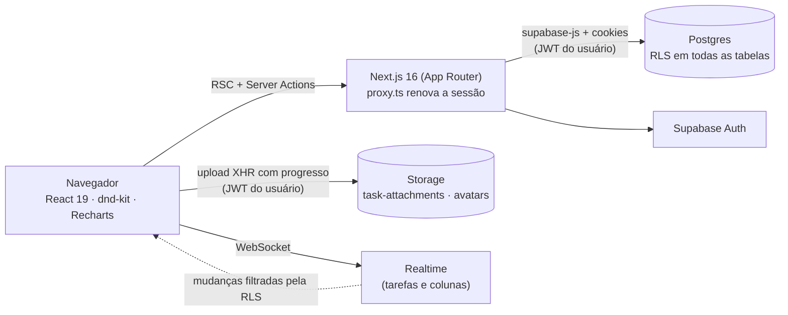
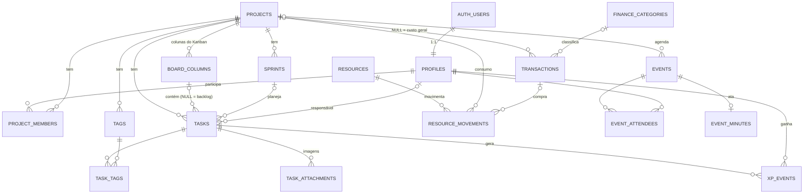
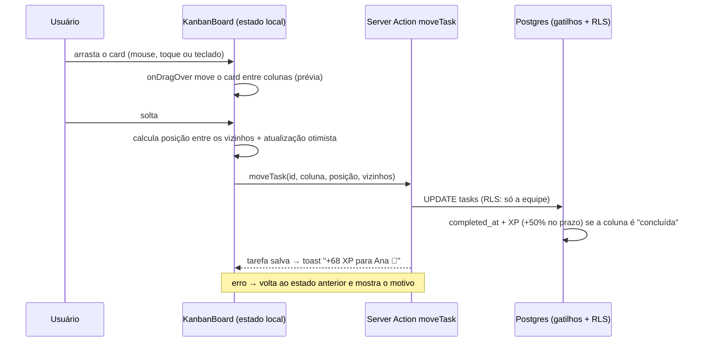
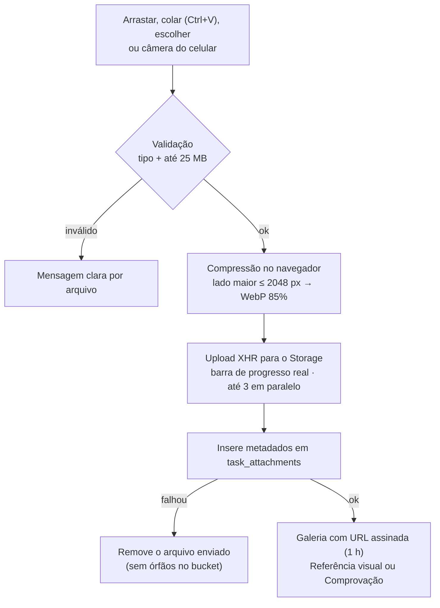

# Arquitetura — MBY Gestão

Aplicativo de gestão de projetos, finanças e equipe da **MBY (Made By You)**.
Este documento descreve o modelo de dados, a segurança, a estrutura de pastas e
os dois componentes mais complexos: o **quadro Kanban** e o **upload de imagens
vinculadas às tarefas**.

- [1. Visão geral](#1-visão-geral)
- [2. Banco de dados](#2-banco-de-dados)
- [3. Segurança (papéis, RLS e Storage)](#3-segurança-papéis-rls-e-storage)
- [4. Estrutura de pastas](#4-estrutura-de-pastas)
- [5. Quadro Kanban (drag-and-drop)](#5-quadro-kanban-drag-and-drop)
- [6. Upload de imagens nas tarefas](#6-upload-de-imagens-nas-tarefas)
- [7. Decisões transversais](#7-decisões-transversais)
- [8. Testes](#8-testes)

---

## 1. Visão geral



| Camada | Tecnologia | Papel |
| --- | --- | --- |
| Interface | Next.js 16 (App Router, Turbopack), React 19, TypeScript | Páginas renderizadas no servidor (RSC) + ilhas interativas (`"use client"`) |
| Estilo | Tailwind CSS v4, componentes no padrão shadcn/ui (Radix), `next-themes` | Tokens de cor claro/escuro em `src/app/globals.css` |
| Dados | Supabase (Postgres, Auth, Storage, Realtime) | Toda regra de acesso mora no banco (RLS) |
| Mutations | Server Actions (`src/server/actions/*`) validadas com Zod | Rodam com a sessão do usuário — a RLS continua valendo |
| Leituras | Funções em `src/server/queries/*` chamadas pelos Server Components | Agregações pesadas ficam em *views* SQL |

Princípio central: **o banco é a fonte da verdade e a última linha de defesa**.
Mesmo que alguém chame a API do Supabase direto do navegador com a chave
publicável, só consegue ler/escrever o que a RLS do seu papel permite. Regras de
negócio que não podem ser burladas (XP, conclusão de tarefas, estoque, papéis)
são gatilhos no Postgres.

---

## 2. Banco de dados

Migrations em [`supabase/migrations`](../supabase/migrations), aplicadas em ordem:

| Arquivo | Conteúdo |
| --- | --- |
| `…_core_schema.sql` | Tipos enumerados, 16 tabelas, restrições e índices |
| `…_functions_triggers.sql` | Funções auxiliares (schema `private`) e gatilhos de negócio |
| `…_views.sql` | Views analíticas (`security_invoker`) |
| `…_rls_policies.sql` | Privilégios e políticas de Row Level Security |
| `…_storage.sql` | Buckets e políticas do Storage |
| `…_realtime_seed.sql` | Publicação do Realtime e categorias financeiras iniciais |
| `…_event_minutes.sql` | Atas de eventos/reuniões (`event_minutes`, 1:1 com `events`) e sua RLS |

### 2.1 Diagrama entidade-relacionamento



### 2.2 Tabelas principais (DDL resumido)

As cinco tabelas centrais pedidas — usuários, projetos, tarefas, transações e
anexos. O DDL completo, com índices, está nas migrations.

```sql
-- Usuários: perfil 1:1 com auth.users + papel de acesso
create table public.profiles (
  id          uuid primary key references auth.users (id) on delete cascade,
  full_name   text not null default '',
  email       text,
  avatar_url  text,
  job_title   text,
  role        public.app_role not null default 'viewer',  -- admin | member | viewer
  created_at  timestamptz not null default now(),
  updated_at  timestamptz not null default now()
);

-- Projetos
create table public.projects (
  id           uuid primary key default gen_random_uuid(),
  name         text not null,
  description  text,
  client_name  text,
  color        text not null default '#0399FB',
  status       public.project_status not null default 'active',  -- planning | active | on_hold | completed | archived
  start_date   date,
  due_date     date,
  budget       numeric(14, 2) check (budget >= 0),
  owner_id     uuid default auth.uid() references public.profiles (id) on delete set null,
  created_at   timestamptz not null default now(),
  updated_at   timestamptz not null default now(),
  check (due_date is null or start_date is null or due_date >= start_date)
);

-- Tarefas: column_id NULL = backlog; position = ordem fracionária na coluna
create table public.tasks (
  id            uuid primary key default gen_random_uuid(),
  project_id    uuid not null references public.projects (id) on delete cascade,
  column_id     uuid,                    -- coluna do Kanban (mesmo projeto, via FK composta)
  sprint_id     uuid,                    -- sprint (mesmo projeto, via FK composta)
  title         text not null,
  description   text,
  assignee_id   uuid references public.profiles (id) on delete set null,
  created_by    uuid default auth.uid() references public.profiles (id) on delete set null,
  priority      public.task_priority not null default 'medium',  -- low | medium | high | urgent
  due_date      date,
  story_points  smallint not null default 1 check (story_points between 0 and 21),
  xp_reward     integer generated always as (story_points * <peso da prioridade>) stored,
  position      double precision not null,
  completed_at  timestamptz,             -- preenchido por gatilho ao entrar numa coluna "concluída"
  created_at    timestamptz not null default now(),
  updated_at    timestamptz not null default now(),
  unique (id, project_id),
  foreign key (column_id, project_id) references public.board_columns (id, project_id) on delete set null (column_id),
  foreign key (sprint_id, project_id) references public.sprints (id, project_id) on delete set null (sprint_id)
);

-- Lançamentos financeiros: project_id NULL = receita/custo geral da equipe
create table public.transactions (
  id           uuid primary key default gen_random_uuid(),
  type         public.transaction_type not null,          -- income | expense
  description  text not null,
  amount       numeric(14, 2) not null check (amount > 0),
  occurred_on  date not null default current_date,
  status       public.transaction_status not null default 'paid',  -- paid | pending
  project_id   uuid references public.projects (id) on delete set null,
  category_id  uuid,
  notes        text,
  created_by   uuid default auth.uid() references public.profiles (id) on delete set null,
  created_at   timestamptz not null default now(),
  updated_at   timestamptz not null default now(),
  -- a categoria precisa ser do mesmo tipo (receita/despesa) do lançamento
  foreign key (category_id, type) references public.finance_categories (id, type) on delete set null (category_id)
);

-- Anexos: o arquivo fica no Storage; aqui ficam os metadados
create table public.task_attachments (
  id            uuid primary key default gen_random_uuid(),
  task_id       uuid not null,
  project_id    uuid not null,
  storage_path  text not null unique,     -- {project_id}/{task_id}/{arquivo}
  file_name     text not null,
  mime_type     text not null check (mime_type in ('image/png','image/jpeg','image/webp','image/gif','image/avif')),
  size_bytes    bigint not null check (size_bytes > 0 and size_bytes <= 10485760),
  width         integer,
  height        integer,
  kind          public.attachment_kind not null default 'reference',  -- reference | proof
  uploaded_by   uuid default auth.uid() references public.profiles (id) on delete set null,
  created_at    timestamptz not null default now(),
  foreign key (task_id, project_id) references public.tasks (id, project_id) on delete cascade,
  check (storage_path like project_id::text || '/' || task_id::text || '/%')
);
```

### 2.3 Demais tabelas

| Tabela | Para que serve | Regras importantes |
| --- | --- | --- |
| `project_members` | Vínculo pessoa ↔ projeto | Define o que um **visualizador/cliente** enxerga |
| `board_columns` | Colunas personalizáveis do Kanban | `is_done` marca a coluna de conclusão; `wip_limit` opcional; 4 colunas padrão criadas por gatilho |
| `sprints` | Ciclos de trabalho | No máximo **uma sprint ativa por projeto** (índice único parcial) |
| `tags` / `task_tags` | Etiquetas por projeto | Nome único por projeto; a política só aceita tag do mesmo projeto da tarefa |
| `xp_events` | Livro-razão de XP | Escrito **apenas por gatilho**; `unique (task_id, reason)` impede XP em dobro |
| `finance_categories` | Categorias de receita/despesa | 13 categorias iniciais (seed) |
| `resources` | Insumos/materiais em estoque | `quantity` e `unit_cost` (custo médio ponderado) mantidos por gatilho |
| `resource_movements` | Entradas (compras) e saídas (consumo por projeto) | Saída maior que o estoque é bloqueada no banco |
| `events` / `event_attendees` | Reuniões, eventos e marcos | `type`: `meeting`, `event`, `milestone`; podem ser de um projeto |

### 2.4 Gatilhos (regras de negócio no banco)

| Gatilho | O que garante |
| --- | --- |
| `handle_new_user` | Cria o perfil no cadastro. **A primeira conta vira `admin`**; as seguintes entram como `viewer` (menor privilégio) até um admin promover |
| `guard_profile_update` | Só admin altera papéis; sempre resta ao menos um admin; e-mail só muda via Auth |
| `handle_new_project` | Cria as colunas *A Fazer, Em Andamento, Revisão, Concluído* e adiciona o dono como membro |
| `tasks_before_write` | Posição padrão no fim da coluna; `completed_at` preenchido/limpo conforme a coluna é ou não de conclusão |
| `tasks_award_xp` | Ao concluir: XP = pontos × peso da prioridade (baixa 5, média 10, alta 15, urgente 20), **+50% se no prazo**; reabrir remove o XP |
| `board_columns_after_update` | Marcar/desmarcar uma coluna como “concluída” atualiza as tarefas dela (e o XP) |
| `resource_movements_*` | Entrada recalcula o custo médio ponderado; saída valida saldo (“Estoque insuficiente…”) e usa o custo médio; exclusão estorna |

### 2.5 Views analíticas

Todas com `security_invoker = on` (respeitam a RLS de quem consulta):

- `project_progress` — tarefas/pontos totais e concluídos, backlog e atrasadas por projeto.
- `member_stats` — XP, concluídas, no prazo, abertas e últimos 30 dias por pessoa.
- `finance_monthly` — receitas, despesas, saldo e pendências por mês.
- `project_financials` — orçamento, receitas, despesas e custo de materiais consumidos por projeto.

---

## 3. Segurança (papéis, RLS e Storage)

| Recurso | Admin | Membro | Visualizador / Cliente |
| --- | --- | --- | --- |
| Projetos, quadro, backlog, sprints, tarefas, anexos | Tudo | Criar/editar (excluir projeto só se for o dono) | **Somente leitura** dos projetos em que é membro |
| Financeiro e insumos | Tudo, inclusive **excluir** lançamentos/insumos | Criar/editar | Sem acesso |
| Calendário e atas | Tudo | Criar/editar | Eventos dos seus projetos ou em que é participante; atas só dos eventos em que é participante (leitura) |
| Equipe | Alterar papéis e convidar | Ver perfis e ranking | Ver perfis e ranking |

Como foi implementado:

- **RLS habilitada em todas as tabelas**, uma política por tabela/comando, e
  `auth.uid()`/helpers envoltos em `(select …)` para serem avaliados uma vez por
  consulta (recomendação de performance do Supabase).
- Funções auxiliares `SECURITY DEFINER` (`my_role`, `is_admin`, `is_staff`,
  `my_project_ids`, `can_view_project`, `task_in_project`) ficam no schema
  `private`, **não exposto pela API** — evitam recursão de RLS sem abrir RPCs.
- O papel `anon` não tem acesso a nenhuma tabela; `authenticated` não pode
  `TRUNCATE`.
- **Storage**:
  - `task-attachments` (privado, 10 MB, só imagens): leitura para quem vê o
    projeto (por URL assinada de 1 h); escrita apenas pela equipe e **somente em
    `{project_id}/{task_id}/…` de uma tarefa que pertence àquele projeto**.
  - `avatars` (público, 2 MB): cada usuário só escreve na própria pasta `{user_id}/…`.
- A `SUPABASE_SERVICE_ROLE_KEY` é **opcional** e usada apenas no servidor (convite
  por e-mail). Nunca vai para o navegador nem para o repositório.
- `src/proxy.ts` (o antigo *middleware*) renova a sessão a cada requisição e
  redireciona quem não está logado para `/login`; as páginas também verificam o
  papel no servidor (`requireStaff`) — o visualizador não acessa `/finance`.

Os *advisors* de segurança do Supabase rodaram sem apontamentos após as migrations.

---

## 4. Estrutura de pastas

```text
.
├── docs/ARQUITETURA.md            ← este documento
├── public/brand/                  ← logo MβY e mascote capivara (WebP)
├── supabase/migrations/           ← schema, gatilhos, views, RLS, storage, seed
└── src/
    ├── proxy.ts                   ← sessão Supabase + proteção de rotas (Next 16)
    ├── app/
    │   ├── (auth)/                ← login, cadastro, Server Actions de autenticação
    │   ├── auth/callback/         ← confirmação de e-mail, convites, recuperação
    │   └── (app)/                 ← área logada (sidebar + menu mobile)
    │       ├── dashboard/         ← visão macro: burn-down, urgentes, saldo, receitas x despesas
    │       ├── projects/
    │       │   └── [projectId]/   ← visão geral · board/ (Kanban) · backlog/ (sprints)
    │       ├── calendar/          ← visões mensal e semanal
    │       ├── finance/           ← lançamentos, histórico mensal · resources/ (insumos)
    │       ├── team/              ← equipe, ranking de XP · [userId]/ (perfil)
    │       └── settings/          ← perfil, avatar e senha
    ├── components/
    │   ├── kanban/                ← quadro, colunas, cards, filtros, realtime
    │   ├── tasks/                 ← painel da tarefa, criação, campos
    │   │   └── attachments/       ← dropzone, fila de upload, galeria, lightbox
    │   ├── backlog/ calendar/ finance/ team/ projects/ dashboard/ settings/
    │   ├── charts/                ← burn-down, fluxo de caixa, barras semanais
    │   ├── layout/ brand/ shared/ ← sidebar, cabeçalhos, logo, estados vazios
    │   └── ui/                    ← componentes base (padrão shadcn/ui sobre Radix)
    ├── lib/
    │   ├── supabase/              ← clientes browser/servidor/proxy + tipos gerados
    │   ├── kanban/                ← estado do quadro e posições fracionárias (puros, testados)
    │   ├── storage/               ← validação/compressão de imagem e upload com progresso
    │   ├── analytics/             ← burn-down e escalas de gráfico
    │   ├── gamification.ts        ← níveis, títulos e conquistas
    │   ├── timezone.ts format.ts money.ts constants.ts types.ts
    └── server/
        ├── actions/               ← Server Actions (Zod + RLS) por módulo
        └── queries/               ← leituras para os Server Components
```

---

## 5. Quadro Kanban (drag-and-drop)

Arquivos: [`kanban-board.tsx`](../src/components/kanban/kanban-board.tsx),
[`kanban-column.tsx`](../src/components/kanban/kanban-column.tsx),
[`kanban-card.tsx`](../src/components/kanban/kanban-card.tsx),
[`board-state.ts`](../src/lib/kanban/board-state.ts),
[`positions.ts`](../src/lib/kanban/positions.ts) e a action `moveTask` em
[`server/actions/board.ts`](../src/server/actions/board.ts).



Decisões principais:

- **Estado normalizado e puro** (`BoardState = { columns, tasksByColumn }`), com
  funções sem efeitos colaterais (`moveTaskInState`, `computeTaskPosition`,
  filtros…) cobertas por testes unitários.
- **Posições fracionárias** (`double precision`): mover um card grava **uma
  única linha** — a nova posição é a média entre os vizinhos (`positionBetween`).
  Quando o intervalo fica menor que `1e-6`, a action chama a RPC
  `rebalance_task_positions` para renumerar a coluna (passo 1024).
- **Sensores**: mouse (ativa após 6 px, para não confundir com clique), toque
  (segurar 200 ms) e **teclado** — `Espaço` pega o card, `←/→` troca de coluna,
  `↑/↓` reordena, `Espaço/Enter` solta e `Esc` cancela. Os anúncios para leitores
  de tela são em português e informam coluna e posição.
- **Detecção de colisão própria**: ao arrastar colunas, considera só colunas;
  ao arrastar cards, usa o ponteiro (`pointerWithin`) e, sobre o espaço vazio de
  uma coluna, mira o card mais próximo — soltar no fim de uma coluna longa funciona.
- **Atualização otimista com rollback**: a interface responde na hora; se o
  servidor recusar (permissão, rede), o quadro volta ao instantâneo anterior.
- **Colunas personalizáveis**: criar, renomear, colorir, definir limite WIP
  (com aviso ao exceder), marcar como “concluída” e reordenar arrastando; ao
  excluir, escolhe-se para onde vão as tarefas (outra coluna ou backlog).
- **Tempo real**: `useBoardRealtime` escuta `tasks`/`board_columns` do projeto
  (a RLS filtra o que cada um recebe) e recarrega o quadro com *debounce*,
  sem interromper um arraste em andamento.
- **Card da tarefa**: título, etiquetas, prioridade, prazo (atrasada/hoje/entregue),
  contador de anexos, pontos e responsável. Clicar abre o painel lateral com
  link direto (`?task=<id>`).

---

## 6. Upload de imagens nas tarefas

Arquivos: [`images.ts`](../src/lib/storage/images.ts) (validação e compressão),
[`attachments.ts`](../src/lib/storage/attachments.ts) (upload com progresso, URLs
assinadas, registro e exclusão),
[`use-task-attachments.ts`](../src/components/tasks/attachments/use-task-attachments.ts)
(fila), [`attachment-dropzone.tsx`](../src/components/tasks/attachments/attachment-dropzone.tsx),
[`task-attachments.tsx`](../src/components/tasks/attachments/task-attachments.tsx) e
[`image-lightbox.tsx`](../src/components/tasks/attachments/image-lightbox.tsx).



Detalhes:

- **Onde fica o arquivo**: bucket privado `task-attachments`, caminho
  `{project_id}/{task_id}/{uuid}-{nome}.webp`. O banco confere o prefixo do caminho
  (`check`) e a política do Storage confere que a tarefa pertence ao projeto.
- **Compressão**: uma foto de celular de 4032×3024 vira WebP de 2048×1536
  (no teste ponta a ponta, 753 KB → 117 KB). GIFs (podem ser animados) e imagens
  pequenas vão como estão; se a versão comprimida ficar maior, mantém-se a
  original. A orientação EXIF é respeitada.
- **Progresso real**: o envio usa `XMLHttpRequest` (o `fetch` não expõe
  progresso de upload) direto para `/storage/v1/object/…` com o JWT do usuário —
  a RLS do Storage vale normalmente.
- **Fila**: cada item passa por `na fila → processando → enviando (%) → salvando →
  pronto`, com **cancelar** (AbortController) e **tentar de novo**. Fechar o
  painel cancela os envios pendentes e libera as pré-visualizações.
- **Tipos de anexo**: *Referência visual* ou *Comprovação de conclusão*
  (alternável depois); o painel mostra quantas comprovações a tarefa tem.
- **Exclusão consistente**: apaga primeiro o arquivo e depois o registro; excluir
  uma tarefa ou um projeto também limpa os arquivos do bucket.
- **Visualização**: miniaturas em grade e *lightbox* em tela cheia com
  navegação por setas e download.

---

## 7. Decisões transversais

- **Fuso horário**: a equipe trabalha em `America/Sao_Paulo`, mas a Vercel roda
  em UTC. Datas puras (`date`) nunca passam por fuso; horários (`timestamptz`)
  são exibidos sempre no fuso da equipe (`src/lib/timezone.ts`), no servidor e no
  navegador — sem “dia errado” perto da meia-noite.
- **Dinheiro**: `numeric(14,2)` no banco; entrada no formato brasileiro
  (`1.234,56`) convertida por `parseMoney` (testada).
- **Identidade visual**: paleta derivada do logotipo MβY (azul `#0399FB`) e do
  mascote capivara de moletom azul-claro; fonte Plus Jakarta Sans; tema claro e
  escuro com tokens próprios.
- **Gráficos**: uma escala por gráfico (sem eixo duplo), paleta categórica
  validada para daltonismo e contraste nos dois temas, marcas de eixo
  “redondas” (`niceTicks`), legenda + tooltip em todos.
- **Gamificação**: nível = ⌊√(XP/50)⌋ + 1 (nível 2 com 50 XP, 3 com 200, 4 com
  450…), títulos de “Capivara Aprendiz” a “Capivara Lendária” e conquistas
  (primeira entrega, 25/100 tarefas, ≥90% no prazo, 10 em 30 dias, 1000 XP).

---

## 8. Testes

- **Unitários** (`npm test`, Vitest): posições fracionárias, estado do quadro,
  burn-down, escalas de gráfico, gamificação, validação de imagens, dinheiro e
  fuso horário.
- **Banco**: as migrations foram validadas num Postgres local com *shims* do
  Supabase (auth, storage) incluindo testes de RLS por papel, e aplicadas no
  projeto `MBY-Gestao` com os *advisors* de segurança limpos.
- **Ponta a ponta**: roteiro Playwright cobrindo cadastro, criação de projeto,
  adição rápida, edição no painel, upload de comprovação, arrastar para
  “Concluído” (XP), reordenar, arraste por teclado, coluna com WIP, backlog e
  sprint, financeiro, insumos (incluindo bloqueio de estoque insuficiente),
  calendário mensal/semanal, dashboard, equipe, tema escuro, restrições do
  visualizador e layout mobile.
